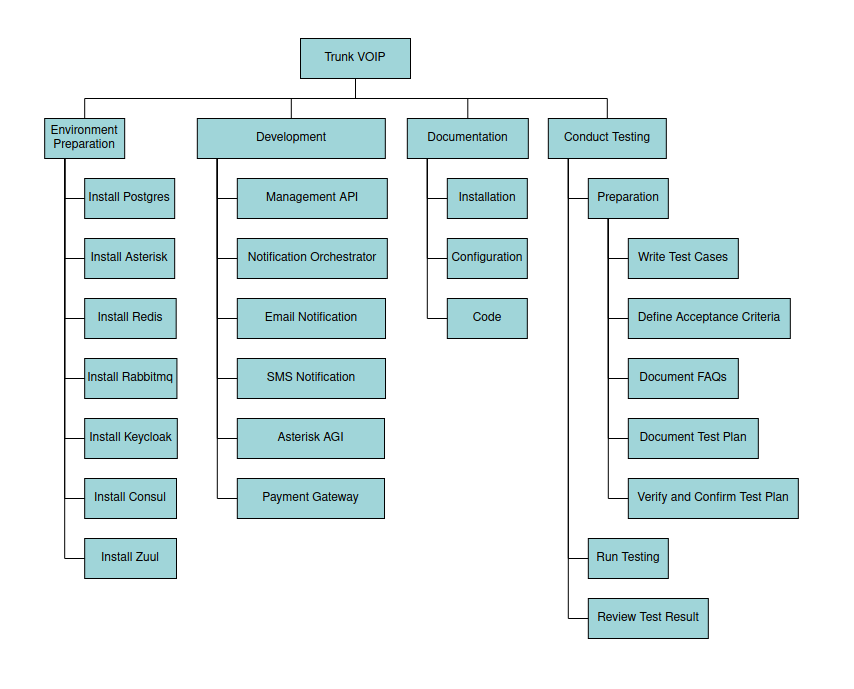
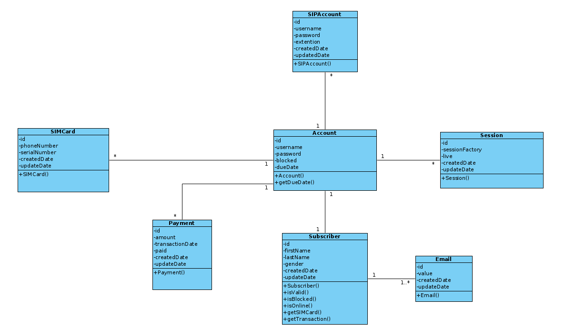
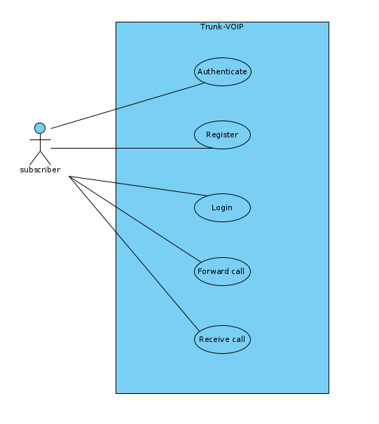
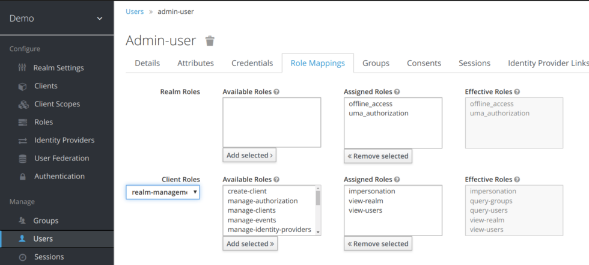
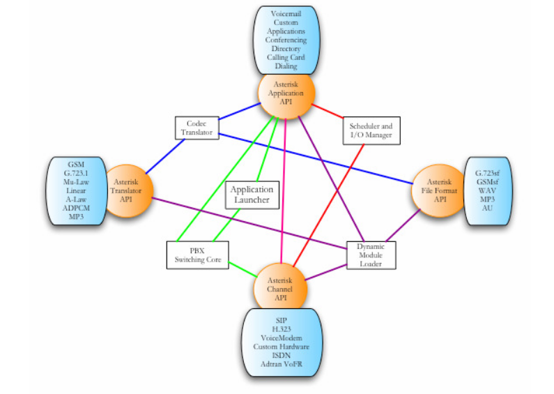
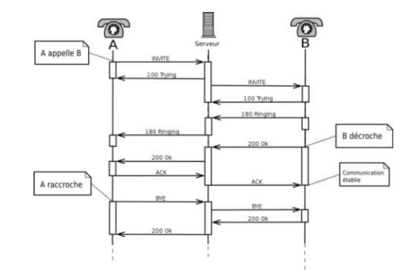

### Note: Please Read `analyze-fonctionnelle.md` before read this document

# Methodologies:
## WBS

## Class Digramme

## Use case

# Technique
## Keycloak : Pour obtenir l'authentification, nous devons utiliser keycloak. 
Keycloak est un produit logiciel open source permettant une connexion unique avec Identity and Access Management destiné aux applications et services modernes.
La première version de production de Keycloak remonte à septembre 2014, le développement ayant commencé environ un an plus tôt. 
En 2016, Red Hat est passé du produit RH SSO basé sur le framework PicketLink à celui du projet amont Keycloak.
Dans une certaine mesure, Keycloak peut maintenant également être considéré comme un remplacement du produit open source Red Hat JBoss SSO qui était auparavant remplacé par PicketLink. 
Depuis mars 2018, JBoss.org redirige l'ancien sous-site jboss sso vers le site Web de Keycloak. 
Le nom JBoss est une marque déposée et Red Hat a déplacé ses noms de projets open source en amont pour éviter d'utiliser JBoss, JBoss AS à Wildfly étant un exemple plus communément reconnu.

Keycloak est une solution d'authentification unique pour les applications Web et les services Web RESTful.
L'objectif de Keycloak est de simplifier la sécurité afin que les développeurs d'applications puissent facilement sécuriser les applications et les services qu'ils ont déployés dans leur organisation.
Les fonctionnalités de sécurité que les développeurs doivent normalement écrire pour eux-mêmes sont fournies prêtes à l'emploi et sont facilement adaptables aux besoins individuels de votre organisation. 
Keycloak fournit des interfaces utilisateur personnalisable pour la connexion, l'enregistrement, l'administration et la gestion des comptes.
 Vous pouvez également utiliser Keycloak comme plate-forme d'intégration pour le connecter aux serveurs LDAP et Active Directory existants. 
Vous pouvez également déléguer l'authentification à des fournisseurs d'identité tiers tels que Facebook et Google+.

#### les traits :
Parmi les nombreuses fonctionnalités de Keycloak, citons :
1. User Registration
2. Social login
3. Single Sign-On/Sign-Off across all applications belonging to the same Realm
4. 2-factor authentication
5. LDAP integration
6. Kerberos broker
7. multitenancy with per-realm customizable skin

#### Les Composantes :
Il existe 2 composants principaux de Keycloak :
1. Serveur Keycloak
2. Adaptateur d'application Keycloak

#### Concepts et termes de base :
Nous devons connaître certains concepts et termes clés avant d'essayer d'utiliser Keycloak pour sécuriser vos applications Web et services REST.

1. users : Les utilisateurs sont des entités capables de se connecter à votre système. Ils peuvent être associés à des attributs tels que l'email, le nom d'utilisateur, l'adresse, le numéro de téléphone et le jour de naissance.
Ils peuvent se voir attribuer une appartenance à un groupe et se voir attribuer des rôles spécifiques.
2. authentication : Processus d'identification et de validation d'un utilisateur.
3. autorisation : Processus d'octroi de l'accès à un utilisateur.
4. credentials : Les informations d'identification sont des éléments de données que Keycloak utilise pour vérifier l'identité d'un utilisateur. 
Certains exemples sont les mots de passe, les mots de passe à usage unique, les certificats numériques ou même les empreintes digitales.
5. roles : Les rôles identifient un type ou une catégorie d'utilisateur. L'administrateur, l'utilisateur, 
le responsable et l'employé sont tous des rôles typiques qui peuvent exister dans une organisation.
Les applications attribuent souvent un accès et des autorisations à des rôles spécifiques plutôt qu'à des utilisateurs individuels, 
car le traitement des utilisateurs peut être trop fin et difficile à gérer.
6. user role mapping : Un mappage de rôle utilisateur définit un mappage entre un rôle et un utilisateur. Un utilisateur peut être associé à zéro ou plusieurs rôles. Ces informations de mappage de rôle peuvent être encapsulées dans des jetons et des assertions afin que les applications puissent décider des autorisations d'accès sur diverses ressources qu'elles gèrent.
7. composite roles : Un rôle composite est un rôle qui peut être associé à d'autres rôles. Par exemple, un rôle composite de super utilisateur peut être associé aux rôles sales-admin et order-entry-admin. Si un utilisateur est mappé au rôle de super utilisateur, 
il hérite également des rôles sales-admin et order-entry-admin.
8. groups : Les groupes gèrent des groupes d'utilisateurs. Les attributs peuvent être définis pour un groupe. Vous pouvez également mapper des rôles à un groupe.
Les utilisateurs qui deviennent membres d'un groupe héritent des attributs et des mappages de rôles définis par ce groupe.
9. realms : Un domaine gère un ensemble d'utilisateurs, d'informations d'identification, de rôles et de groupes. Un utilisateur appartient et se connecte à un royaume. 
Les royaumes sont isolés les uns des autres et ne peuvent gérer et authentifier que les utilisateurs qu'ils contrôlent.
10. clients :Les clients sont des entités qui peuvent demander à Keycloak d'authentifier un utilisateur. Le plus souvent, les clients sont des applications et des services qui souhaitent utiliser Keycloak pour se sécuriser et fournir une solution d'authentification unique.
Les clients peuvent également être des entités qui souhaitent simplement demander des informations d'identité ou un jeton d'accès afin de pouvoir appeler en toute sécurité d'autres services sur le réseau qui sont sécurisés par Keycloak.
11. client adapters : Les adaptateurs clients sont des plugins que vous installez dans votre environnement d'application pour pouvoir communiquer et être sécurisé par Keycloak. Keycloak dispose d'un certain nombre d'adaptateurs pour différentes plates-formes que vous pouvez télécharger. 
Il existe également des adaptateurs tiers que vous pouvez obtenir pour les environnements que nous ne couvrons pas.
12. consent : Le consentement, c'est lorsque vous, en tant qu'administrateur, souhaitez qu'un utilisateur donne l'autorisation à un client avant que ce client puisse participer au processus d'authentification. Une fois qu'un utilisateur a fourni ses informations d'identification, Keycloak affichera un écran identifiant le client demandant une connexion et les informations d'identité demandées à l'utilisateur.
 L'utilisateur peut décider d'accorder ou non la demande.
13. client scopes : Lorsqu'un client est enregistré, vous devez définir des mappers de protocole et des mappages d'étendue de rôle pour ce client. Il est souvent utile de stocker une étendue de client, pour faciliter la création de nouveaux clients en partageant certains paramètres communs. Ceci est également utile pour demander à certaines revendications ou rôles d'être conditionnellement basés sur la valeur du paramètre scope.
 Keycloak fournit le concept de portée client pour cela.
14. client role : Les clients peuvent définir des rôles qui sont spécifiques. Il s'agit essentiellement d'un espace de noms de rôle dédié au client.
15. identity token : Un jeton qui fournit des informations d'identité sur l'utilisateur. Fait partie de la spécification OpenID Connect.
16. access token : Jeton qui peut être fourni dans le cadre d'une requête HTTP qui accorde l'accès au service appelé. Cela fait partie de la spécification OpenID Connect et OAuth 2.0.
17. assertion : Informations sur un utilisateur. Cela concerne généralement un objet blob XML inclus dans une réponse d'authentification SAML qui a fourni des métadonnées d'identité sur un utilisateur authentifié.
18. service account : Chaque client dispose d'un compte de service intégré qui lui permet d'obtenir un jeton d'accès.
19. direct grant : Un moyen pour un client d'obtenir un jeton d'accès au nom d'un utilisateur via un appel REST.
20. protocol mappers : Pour chaque client, vous pouvez personnaliser les revendications et assertions stockées dans le jeton OIDC ou l'assertion SAML. Vous faites cela par client en créant et en configurant des mappers de protocole.
21. session : Lorsqu'un utilisateur se connecte, une session est créée pour gérer la session de connexion. Une session contient des informations telles que le moment où l'utilisateur s'est connecté et les applications qui ont participé à l'authentification unique au cours de cette session. 
Les administrateurs et les utilisateurs peuvent afficher les informations de session.
22. user federation provider : Keycloak peut stocker et gérer les utilisateurs. Souvent, les entreprises disposent déjà de services LDAP ou Active Directory qui stockent les informations relatives aux utilisateurs et aux informations d'identification. 
Vous pouvez demander à Keycloak de valider les informations d'identification de ces magasins externes et d'extraire des informations d'identité.
23. identity provider : Un fournisseur d'identité (IDP) est un service qui peut authentifier un utilisateur. Keycloak est un IDP.
24. identity provider federation : Keycloak peut être configuré pour déléguer l'authentification à un ou plusieurs IDP. La connexion sociale via Facebook ou Google+ est un exemple de fédération de fournisseurs d'identité.
 Vous pouvez également accrocher Keycloak pour déléguer l'authentification à tout autre IDP OpenID Connect ou SAML 2.0.
25. identity provider mappers : Lorsque vous effectuez la fédération IDP, vous pouvez mapper les jetons et les assertions entrantes aux attributs d'utilisateur et de session. 
Cela vous aide à propager les informations d'identité de l'IDP externe à votre client demandant l'authentification.
26. required actions : Les actions requises sont des actions qu'un utilisateur doit effectuer pendant le processus d'authentification. Un utilisateur ne pourra pas terminer le processus d'authentification tant que ces actions ne seront pas terminées. Par exemple, un administrateur peut programmer les utilisateurs pour réinitialiser leurs mots de passe chaque mois.
 Une action de mise à jour du mot de passe requise serait définie pour tous ces utilisateurs.
27. authentication flows : Les flux d'authentification sont des flux de travail qu'un utilisateur doit effectuer lorsqu'il interagit avec certains aspects du système. Un flux de connexion peut définir les types d'informations d'identification requis. Un flux d'inscription définit les informations de profil qu'un utilisateur doit saisir et si quelque chose comme reCAPTCHA doit être utilisé pour filtrer les bots.
 Le flux de réinitialisation des informations d'identification définit les actions qu'un utilisateur doit effectuer avant de pouvoir réinitialiser son mot de passe.
28. events : Les événements sont des flux d'audit que les administrateurs peuvent afficher et auxquels ils peuvent se connecter.
29. themes : Chaque écran fourni par Keycloak est soutenu par un thème. Les thèmes définissent des modèles HTML et des feuilles de style que vous pouvez remplacer si nécessaire.

### Asterisk: Pour faire forward les apples chez le client, nous utilisions l'Asterisk.
Asterisk est un autocommutateur téléphonique privé (PABX) libre et propriétaire (publié sous double licence GPLv2 ou commerciale6) pour systèmes GNU/Linux. Il permet, entre autres, la messagerie vocale, les files d'attente, les agents d'appels, les musiques d'attente et les mises en garde d'appels, la distribution des appels. Il est possible également d'ajouter l'utilisation des conférences par le biais de l'installation de modules supplémentaires et la recompilation des binaires.

Asterisk implémente les protocoles H.320, H.323 et SIP, ainsi qu'un protocole spécifique nommé IAX (Inter-Asterisk eXchange). 
Ce protocole IAX permet la communication entre deux serveurs Asterisk ainsi qu'entre client et serveur Asterisk. Asterisk peut également jouer le rôle de registrar et passerelle avec les réseaux publics (RTC, GSM, etc.)
Asterisk est extensible par des scripts ou des modules en langage Perl, C, Python, PHP, et Ruby.

Asterisk est conçu en 1999, créé par Mark Spencer (en), alors étudiant de l'université d'Auburn (États-Unis - Alabama).
À la recherche d'un commutateur téléphonique privé pour créer un centre de support technique sur Linux, il est dissuadé par les tarifs trop élevés des solutions existantes,
et décide de se créer son propre routeur d'appels sous Linux, le PBX Asterisk. Quelque temps après, il fonde la société Digium, fournisseur de cartes FXO et FXS compatibles avec Asterisk. 

#### Fonctionnalités :
1. Messagerie vocale 
2. Conférence téléphonique 
3. Répondeur vocal interactif 
4. Mise en attente d’appels 
5. Services d'identification de l'appelant 
6. VoIP

#### VOIP
"VoIP" est un abrégé de l’anglais Voice Over IP parfois appelé (téléphonie) IP ou téléphonie sur Internet. Cette technologie permet de communiquer par voix via le réseau Internet ou autres réseaux supportant le protocole TCP/IP.

La VoIP doit non seulement simplifier la mise en place (installation et configuration) mais aussi faire économiser de l’argent.
En effet les entreprises dépensent énormément en communication téléphonique, hors le prix des communications de la VoIP est dérisoire en comparaison. 
Il suffit de louer des hébergeurs pour transmettre les communications sans avoir à payer tous les services. Cela offre donc une grande indépendance. 
L’entreprise peut installer facilement son propre PABX au lieu d’utiliser des offres onéreuses en pure téléphonie (PABX Ericsson, Alcatel,...).
Ajouté à cela le fait qu’il faille un personnel compétent pour administrer ces PABX ordinaire, il revient donc très vite essentiel de faire de la VoIP. 
Le transport se faisant aussi par le biais du réseau informatique, il n’est donc pas nécessaire de devoir mettre en place un réseau téléphonique à part.
Le tout est alors centralisé sur une même entité. De plus, en positionnant la voix comme une application supplémentaire sur le réseau IP, 
l’entreprise ne va pas uniquement substituer un transport opérateur RTC à un transport IP, mais simplifié la gestion de la voix, des données et vidéo par ce seul transport.

#### SIP

SIP (Session Initiation Protocol, RFC 3261) est un protocole de signalisation de niveau Application pour la gestion de session audio indépendant du protocole de transport IP (UDP/TCP). 
Ce protocole avancé permet aux utilisateurs de maintenir, transférer, renvoyer, mettre en attente un appel ou encore de réaliser des conférences

SIP permet donc de mettre en place une communication. Pour cela avant que la connexion soit établie, il se charge d’envoyer plusieurs paquets entre les postes afin de définir le début et la fin de la conversation, son type, et sa composante (type d’encodage utilisé pour l’audio).
Ces requêtes sont répertoriées sous divers codes : 
- 1xx : Information - La requête a été reçue par le destinataire et continue à être traitée (ex : 180 = 'en train de sonner') 
- 2xx : Succès (ex : 200 ='OK', 202='acceptée') 
- 3xx : Redirection - Une autre action doit avoir lieue afin de valider la requête 
- 4xx : Erreur du client - La requête contient une syntaxe fausse ou bien elle ne peut pas être traitée par ce serveur (ex : 404 = 'Not found') 
- 5xx : Erreur du serveur - Le serveur n’a pas réussi à traiter une requête qui semble être correcte 
- 6xx : Échec général, la requête ne peut être traitée par aucun serveur

#### Java Spring : Pour faire le management des utilisateurs
Spring est un framework open source pour construire et définir l'infrastructure d'une application Java3, dont il facilite le développement et les tests.En 2004, Rod Johnson a écrit le livre Expert One-on-One J2EE Design and Development4 qui explique les raisons de la création de Spring.

Spring s’appuie principalement sur l’intégration de trois concepts clés : 
1. L’inversion de contrôle est assurée de deux façons différentes : la recherche de dépendances et l'injection de dépendances.
2. La programmation orientée aspect.
3. Une couche d’abstraction.

La couche d’abstraction permet d’intégrer d’autres frameworks et bibliothèques avec une plus grande facilité.
Cela se fait par l’apport ou non de couches d’abstraction spécifiques à des frameworks particuliers.
Il est ainsi possible d’intégrer un module d’envoi de mails plus facilement.

#### Kotlin : Pour developer les applications mobile
Kotlin est un langage de programmation orienté objet et fonctionnel, avec un typage statique qui permet de compiler pour la machine virtuelle Java, JavaScript, et vers plusieurs plateformes en natif (grâce à LLVM). Son développement provient principalement d'une équipe de programmeurs chez JetBrains basée à Saint-Pétersbourg en Russie (son nom vient de l'île de Kotline, près de St. Pétersbourg).
Google annonce pendant la conférence Google I/O 2017 que Kotlin devient le second langage de programmation officiellement pris en charge par Android3 après Java. 
Le 8 mai 2019, toujours lors de la conférence Google I/O, Kotlin devient officiellement le langage de programmation voulu et recommandé par le géant américain Google pour le développement des applications Android4.
Pivotal Software annonce le 4 janvier 2017 le support officiel de Kotlin sur la cinquième version du Framework Spring 5.Kotlin est un langage de programmation moderne à écriture statique utilisé par plus de 60% des développeurs Android professionnels qui contribue à augmenter la productivité, la satisfaction des développeurs et la sécurité du code.

#### RabbitMQ : Pour les microservice communique entre eux d'une manière Async
RabbitMQ est un logiciel d'agent de messages open source qui implémente le protocole Advanced Message Queuing (AMQP),
mais aussi avec des plugins Streaming Text Oriented Messaging Protocol (STOMP) et Message Queuing Telemetry Transport (MQTT).
- Le projet est constitué de :
- Un serveur d'échange RabbitMQ.
- Des passerelles pour protocoles AMQP, HTTP, STOMP, et MQTT.
- Des bibliothèques de client AMQP pour Java, .NET Framework, et Erlang (mais d'autres ont été développés par de tiers).
- Une plateforme de plugin avec une collection prédéfinie, incluant :
    - "Shovel" : réplication de messages entre les agents de messages.
    - "Federation" : partage de messages entre les agents (au niveau exchange).
    - "Management" : monitoring et contrôle des agents et de leurs groupes.

#### Redis: pour la distributed caching
Redis (de l'anglais REmote Dictionary Server qui peut être traduit par « serveur de dictionnaire distant » et jeu de mot avec Redistribute) 
est un système de gestion de base de données clé-valeur scalable, très hautes performances, 
écrit en C ANSI et distribué sous licence BSD. Il fait partie de la mouvance NoSQL et vise à fournir les performances les plus élevées possible.
Redis permet de manipuler des types de données simples : chaînes de caractères, tableaux associatifs, listes, ensembles et ensembles ordonnés.
Une des principales caractéristiques de Redis est de conserver l'intégralité des données en RAM. Cela permet d'obtenir d'excellentes performances en évitant les accès disques, particulièrement coûteux sur ce plan.
Quand la taille des données est trop importante pour tenir en mémoire, Redis peut également utiliser de la mémoire virtuelle.
Afin d'assurer la conservation des données en cas d'incident — la mémoire vive étant volatile — Redis offre la possibilité de « capturer » l'état de la base dans un fichier. Cette technique ne conservant pas les modifications effectuées entre deux captures, 
il est par ailleurs possible de les enregistrer afin de restaurer la base en cas d'incident.
Redis dispose d'un mécanisme publish-subscribe permettant d'émettre des événements aux différents clients connectés sur la base.